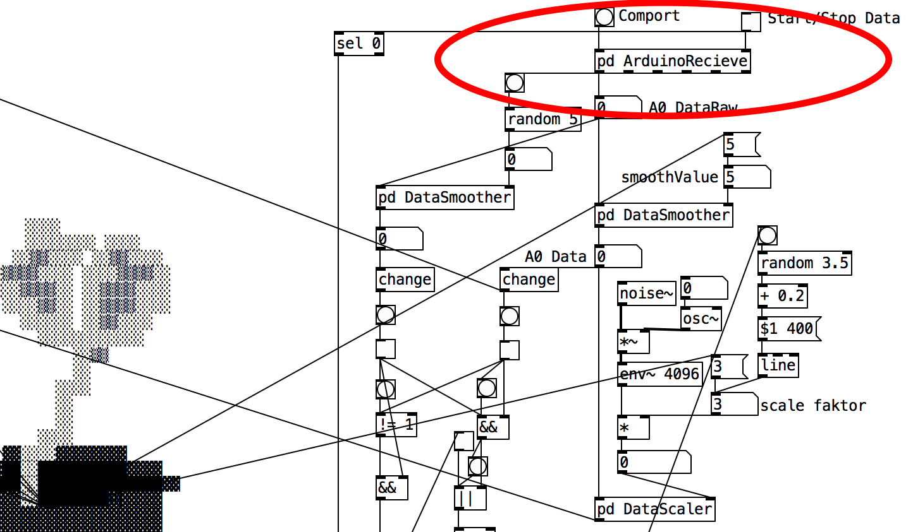
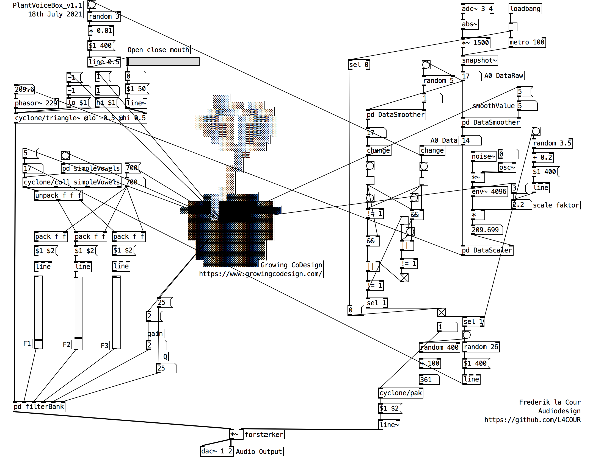
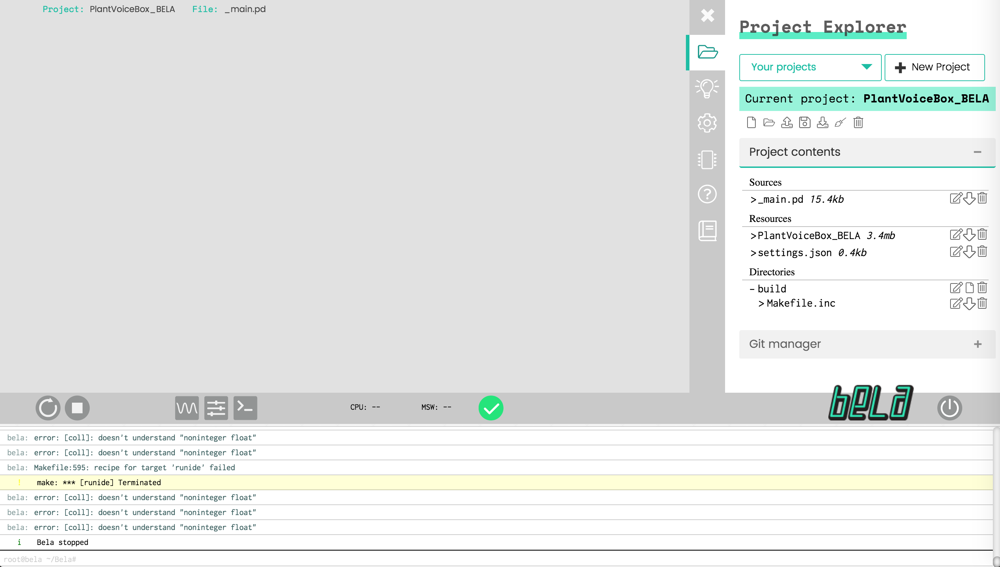

# PlantVoiceBox_Bela

Der er nogle få modifikation der skal til for at få patchen til at køre på BELA Boardet. først og fremmest skal de pure data externals der er anvendt installeres på BELA boardet.

## Installering af Cyclone på BELA
https://forum.bela.io/d/101-compiling-puredata-externals/100

Preparation:
\- get extra header files needed to compile Cyclone (and ggee, and others) on Bela:
\- on your computer open a terminal and:

```
git clone https://github.com/giuliomoro/pure-data &&\
cd pure-data &&\
scp src/*h root@192.168.7.2:/usr/local/include/libpd/ 
```

\- make sure that the `pd-externals` folder exists on Bela:

```
ssh root@192.168.7.2 mkdir -p Bela/projects/pd-externals
```

Now, the externals:

Cyclone:

- get Cyclone from Github. Go to the [releases](https://github.com/porres/pd-cyclone/releases) page. The latest release requires Pd 0.49, but Bela has Pd 0.48-2. So we get the v0.3, RC-1, which requires Pd 0.48-1. Here is the [direct link](https://github.com/porres/pd-cyclone/archive/cyclone0.3rc1.zip) to the source code.

- Download the code on your computer and uncompress it by double clicking on it. This results into an `pd-cyclone-cyclone0.3rc1`. In my case, this is on my Desktop.

- Open a terminal, navigate to the folder containing the pd-cyclone-cyclone0.3rc1 folder. In my case:

  ```
  cd ~/Desktop
  ```

- copy the folder to the board:

  ```
  scp -r pd-cyclone-cyclone0.3rc1 root@192.168.7.2: 
  ```

- go on the board and go into the cyclone folder we just copied:

  ```
  ssh root@192.168.7.2 
  cd pd-cyclone-cyclone0.3rc1/
  ```

- compile Cyclone. The README says that Cyclone uses the pd-lib-builder building system. The provided documentation for pd-lib-builder says that you should invoke "make" by passing the path to the folder containing the Pd includes (in our case, the /usr/local/include/libpd path we copied the ".h" files to earlier on). This may take 10 minutes or so to run, and print some warnings, but all should be fine in the end:

  ```
  make PDINCLUDEDIR=/usr/local/include/libpd
  ```

- once this is successful, you can install the externals. These go in the ~/Bela/projects/pd-externals

  folder we created earlier, and in order to tell pd-lib-builder about it is to set PDLIBDIR when calling make install:

  ```
  make PDLIBDIR=/root/Bela/projects/pd-externals install
  ```

- now if you look into the destination folder you will see all the externals (with extension .pd_linux).

  ```
   ls ~/Bela/projects/pd-externals/cyclone
  ```

- great, test it: open the IDE, create a Pd project, upload a patch like this one:


## Modifikation til PlantVoiceBox.pd



Da vi ikke længere har brug for serial arduino kode kan dette slettes og erstattes af et standard [adc~] objekt that connects with the BELA boards analog input. [Snapshot~] objektet anvendes til at convertere det analog signal til et data signal.
 

Ligeledes omdøbes patch-filen fra PlantVoiceBox.pd til _main.pd for at BELA's Libpd arkitektur kan køre patchen. _main.pd kan herefter drag droppes ind i BELA's IDE http://bela.local og overwriter den eksisterende fil.




for at køre patchen download dette repo og åben repoets folder med Bela og kør programmet.